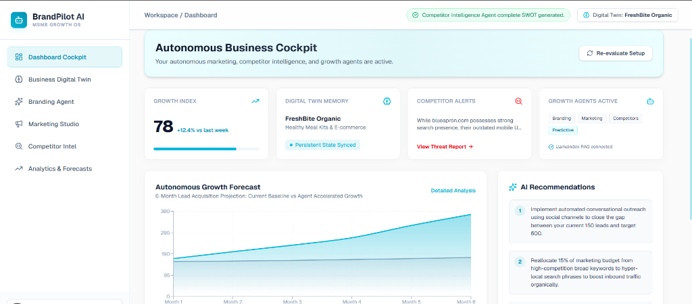

# BrandPilot AI 🚀

Autonomous Business Growth Platform designed for MSMEs, startups, and local businesses. BrandPilot AI acts as an AI Growth Team operating 24/7 to analyze, plan, and execute branding, marketing, and competitor analysis.




## 📂 Project Structure
```text
brandpilot-ai/
├── frontend/             # Next.js 15 App Router Dashboard
│   ├── src/app/
│   │   ├── page.js       // Dashboard Cockpit & Tab Views
│   │   ├── globals.css   // Light Theme Styles
│   │   └── layout.js     // App Shell Configuration
│   └── package.json
│
├── backend/              # FastAPI Python Backend
│   ├── main.py           // API routes & CORS Setup
│   ├── requirements.txt  // Python dependencies
│   ├── agents/           // AI Agent Workflows
│   │   ├── branding_agent.py
│   │   ├── marketing_agent.py
│   │   ├── competitor_agent.py
│   │   └── analytics_agent.py
│   └── .env.example
│
└── project.md            # Vision & Product Scope Guide
```

---

## ⚡ Setup & Launch Instructions

### 1. Launch FastAPI Backend
Open a terminal in the root directory:
```bash
cd backend
python -m venv venv
.\venv\Scripts\activate
pip install -r requirements.txt
uvicorn main:app --port 8000 --reload
```
- API will be active at: `http://127.0.0.1:8000`
- Swagger Docs: `http://127.0.0.1:8000/docs`

### 2. Launch Next.js Frontend
Open a separate terminal:
```bash
cd frontend
npm install
npm run dev
```
- Dashboard active at: `http://localhost:3000`

---

## ⚙️ AI Models Integration
To utilize live generation (Gemini 2.5 Flash), configure your key in `backend/.env`:
```env
GEMINI_API_KEY=your_actual_key_here
```
*Note: If no API key is specified, the system automatically runs on high-fidelity local simulations.*
